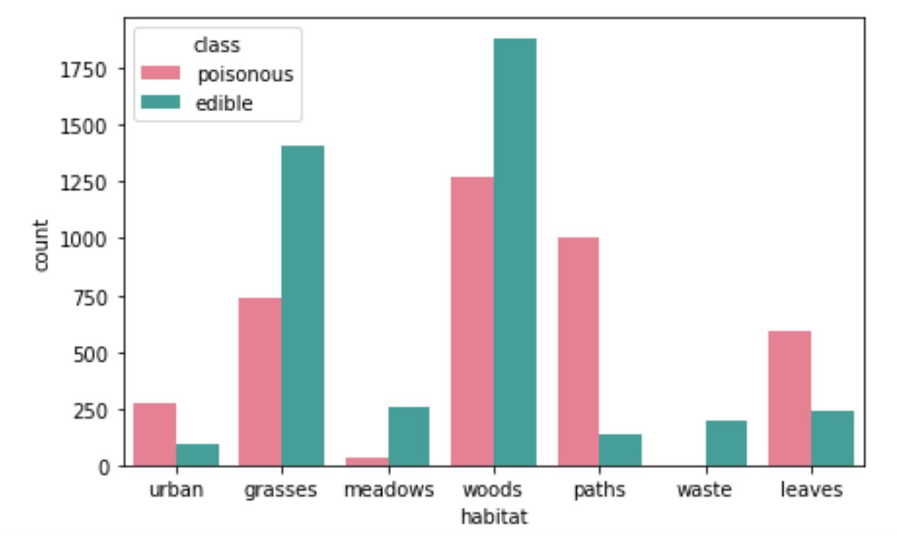

# Mushroom Classification

## Project Overview

Restaurants are looking for a edible mushrooms. It's important to weed all poisonous cases out so no customers face adverse side effects. A single slip up could lead to an ill customer or even a death. This situation must be avoided. 

### Sourcing Your Own Data

attach kaggle maybe
* [Kaggle Datasets](https://www.kaggle.com/datasets)

### The Data

class: The first bar graph that displays the counts for each class, help us clear any possibility of inaccuracy due to a class imbalance. The data is almost evenly split around the categorical variables edible and poisonous.

odor: Interestingly, things that we would typically consider "good" smells are for mainly for edible mushrooms. All other less pleasant smelling mushrooms are indications of a poisonous species.

Ring number: There's a lot of uncertainty with one ring. One ring could be edible or poisonous. Two rings mushrooms are likely to be edible, but we can't be positive. Mushrooms without rings are poisonous.

Spore-print-color: Buff, yellow, orange, and purple mushrooms are edible. Green mushrooms are poisonous. Black and brown mushrooms are mostly edible, but not entirely. Chocolate and white colored mushrooms are mostly poisonous.

Habitat: From the habitat graph one can see that waste has edible mushrooms. Wood and grass areas are more likely to have edible mushrooms, but a lot of mushrooms found in the woody and grassy areas are poisonous. Paths are likely to have poisonous mushrooms.

## Methods

-grid search
-decision tree
-random forest
-logistic regression

## Summary

Edit!

Restaurants are looking for a edible mushrooms with 100% accuracy. A single slip up could lead to an ill customer or even a death. This situation must be avoided. That is why recall and specificity are really important. It is important to have high recall, out of all the positive cases a mushroom forager picked out ALL edible ones. The equation for recall is true positive over true positives and false negatives (which are really positive). The equation for specificity is true negative over true negative and false positive (actually negative). It's important to weed all negative cases out so no customers face adverse side effects. We are not worried about making a type 1 error, predicting a mushroom as poisonous when the mushroom is actually edible. A type II error, predicting a mushroom as edible when it is actually poisonous, would be detrimental to a customer.
