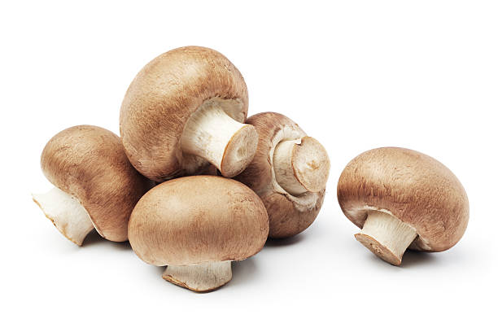
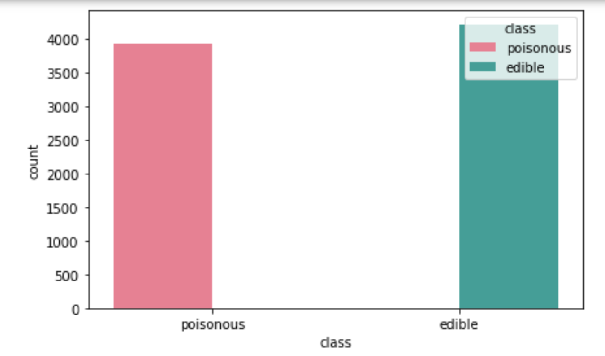
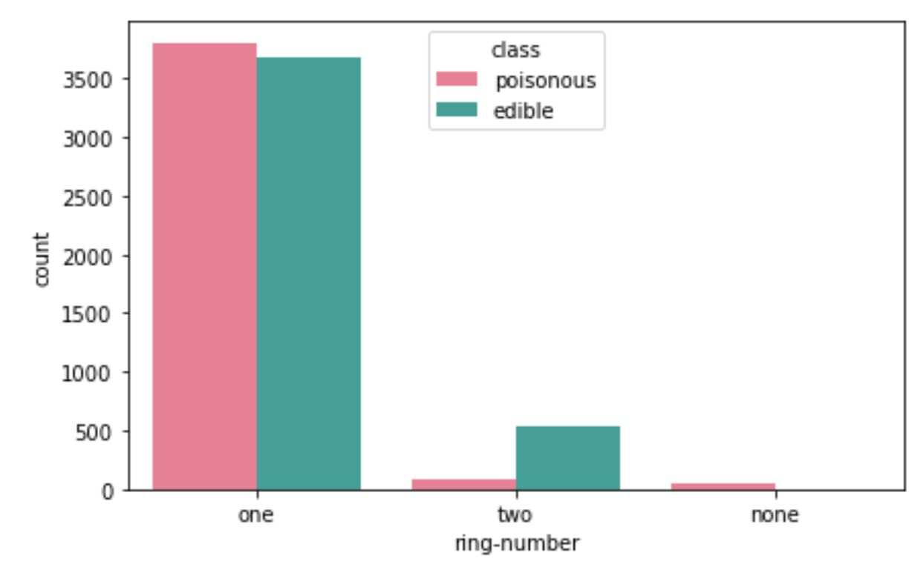
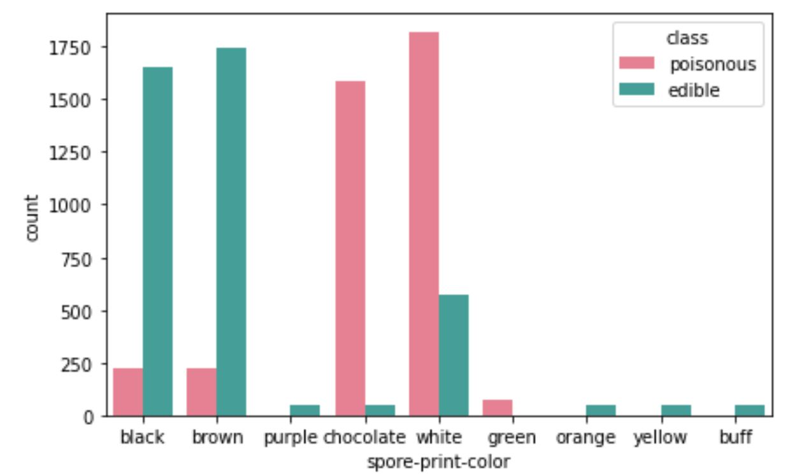
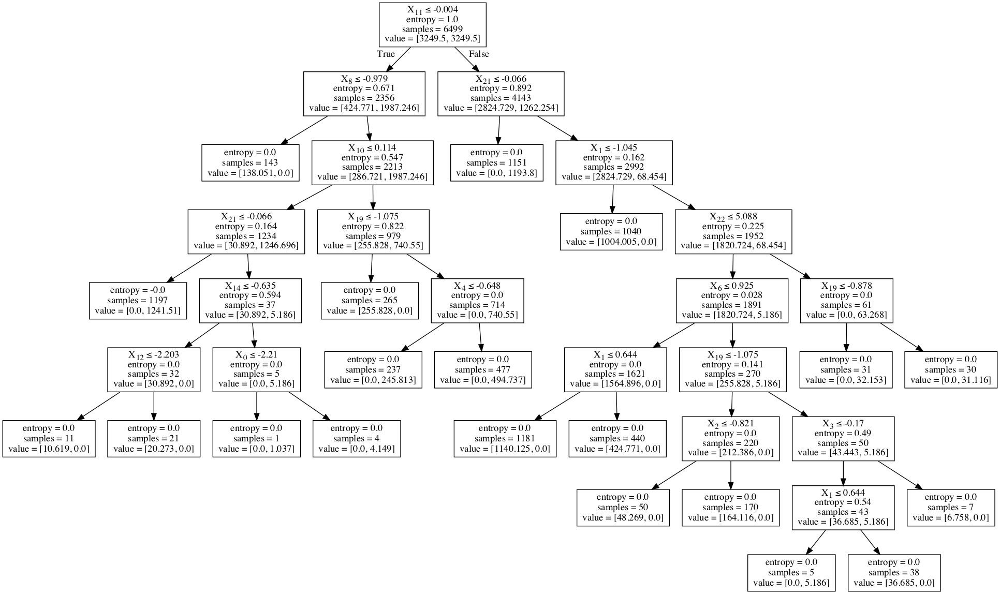

# Mushroom Classification

## Project Overview

Restaurants are looking for edible mushrooms. It's important to weed all poisonous cases out so no customers face adverse side effects. A single slip up could lead to an ill customer or even a death. This situation must be avoided. 

### Data

* [Kaggle Datasets](https://www.kaggle.com/uciml/mushroom-classification)

### The Data

class: The first bar graph that displays the counts for each class, help us clear any possibility of inaccuracy due to a class imbalance. The data is almost evenly split around the categorical variables edible and poisonous. 

odor: Interestingly, things that we would typically consider "good" smells are for mainly for edible mushrooms. All other less pleasant smelling mushrooms are indications of a poisonous species.

Ring number: There's a lot of uncertainty with one ring. One ring could be edible or poisonous. Two rings mushrooms are likely to be edible, but we can't be positive. Mushrooms without rings are poisonous.

Spore-print-color: Buff, yellow, orange, and purple mushrooms are edible. Green mushrooms are poisonous. Black and brown mushrooms are mostly edible, but not entirely. Chocolate and white colored mushrooms are mostly poisonous.

Habitat: From the habitat graph one can see that waste has edible mushrooms. Wood and grass areas are more likely to have edible mushrooms, but a lot of mushrooms found in the woody and grassy areas are poisonous. Paths are likely to have poisonous mushrooms.

## Methods

-feature engineering:

   - habitat: is the mushroom affected by humans
   - rings: does the mushroom have rings
   - odor: split on pleasant and bad odors
   - spore print color: from the bar graph buff, yellow, orange, and purple mushrooms are edible and green are poisonous (domain knowledge corroborated by helpful info provided by [North American Mycology Association](https://namyco.org/spore_prints.php)
   - common characteristics: feature engineer common characteristic of poisonous and edible mushrooms. Domain information came from [Mushroom Appreciation](https://www.mushroom-appreciation.com/identify-poisonous-mushrooms.html#sthash.h1mUk3jo.dpbs) and [Sciencing](https://sciencing.com/identify-poisonous-mushrooms-2057768.html) for poisonous mushrooms and [WikiHow](https://www.wikihow.com/Identify-Edible-Mushrooms) for edible mushrooms. 

-grid search: used to find the best hyperparameters for each model

-Model 1: random forest: uses multiple models to predict the on the categorical variables by splitting on those features that are the most important. (greedy)

-Model 2: decision tree: Spore print color and veil-type had a huge effect on the classification power of decision trees. So, to make a fair model, we removed those two columns and tuned the model that did not spore print color and veil-type.

-Model 3: logistic regression: used to predict on the label encoded numerical values of the dataset to give us our Beta values, also known as logged odds coefficients for each feature. This helps us decide which features are the most important using predictive probability.

## Summary

From the interpretable decision tree one can see without 2 columns (spore print color and veil-type) and tuned hyperparameters from grid search, we see that we still have 100% accuracy. We can use these hyperparameters to test our model.

Restaurants are looking for edible mushrooms with 100% accuracy. A single slip up could lead to an ill customer or even a death. This situation must be avoided. That is why recall and specificity are important. It is important to have high recall, out of all the positive cases a mushroom forager picked out ALL edible ones. The equation for recall is true positive over true positives and false negatives (which are positive). The equation for specificity is true negative over true negative and false positive (negative). It's important to weed all negative cases out so no customers face adverse side effects. We are not worried about making a type 1 error, predicting a mushroom as poisonous when the mushroom is actually edible. A type II error, predicting a mushroom as edible when it is actually poisonous, would be detrimental to a customer.
